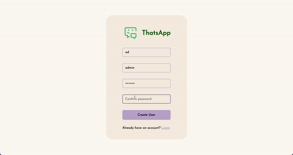

# Realtime Chat App (MERN Stack)
This is a Realtime Chat Application built using the MERN (MongoDB, Express.js, React.js, Node.js) stack. The application allows users to communicate with each other in real-time using a chat feature implemented with Socket.io. The app also features user authentication, allowing only registered users to access the chat functionality.

## Features
- User authentication
- Real-time communication between users
- User-friendly and responsive UI
- Message sending and retrieval API endpoints

## Installation
1. Clone the repository using `git clone https://github.com/Kenatopos/Realtime_Chat_App.git`.
2. Install dependencies in both the public and server directories using `yarn install` and `npm install` seperately.
3. Create a `.env` file in the server directory and include the following variables:
    - `MONGODB_URI` (the MongoDB connection string)
    - `PORT` (the port on which to run the server)
4. Start the server and public concurrently using `npm start` and `yarn start` seperately.

## Technologies Used
- MongoDB: a NoSQL database used to store data
- Express.js: a backend web framework used to build the API endpoints
- React.js: a front-end library used to build the UI
- Node.js: a backend runtime environment used to run the server
- Axios: a Promise-based HTTP client used to make API requests
- Socket.io: a library used to enable real-time communication between users

## Demo
#### Switch from login page and register page:

#### Check if user registered correctly:

#### Select an avatar to complete the registration:

#### Now ready to chat, showing welcome animation:

#### Click and choose one user to chat, messages will deliver immediately:

#### Click the button on the top-right corner, allow user to logout:

